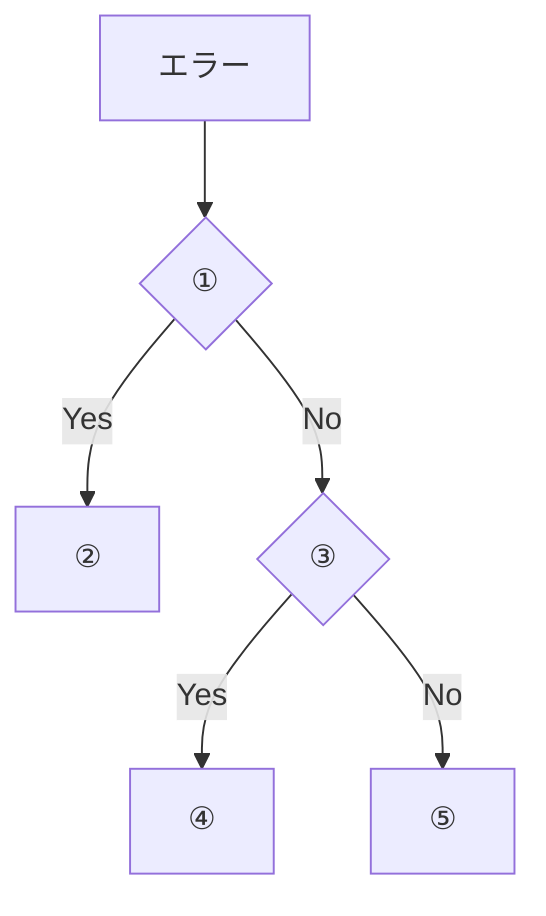

# Flowchart
## TestCaseのエラー処理設定

TestCaseのプロパティでは、実行内容に応じてエラー処理方法を設定すること。

```mermaid
flowchart TD
    A[エラー]
    A --> B{①}

    B -->|Yes| C[②]
    B -->|No| D{③}

    D -->|Yes| E[④]
    D -->|No| F[⑤]
```
①	同階層のSmartFolderを実行する必要があるか
②	次のテストケースに移動
③	エラー発生を想定したテストか
④	次の繰り返しに移動して続行
⑤	次の親テストケースに移動
