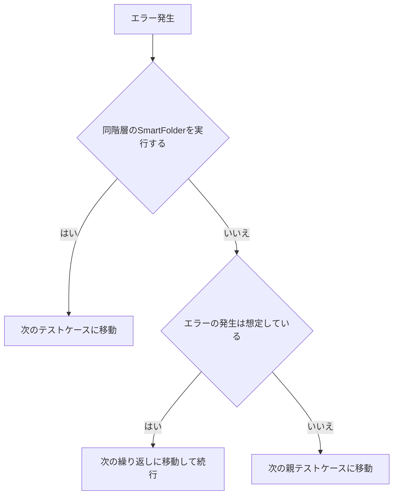

# Flowchart
## TestCaseのエラー処理設定

TestCaseのプロパティでは、実行内容に応じてエラー処理方法を設定すること。

```mermaid
flowchart TD
    A[エラー発生] --> B{同階層のSmartFolderを実行する}

    B -- はい --> C["次のテストケースに移動"]

    B -- いいえ --> D{エラーの発生は想定している}

    D -- はい --> E["次の繰り返しに移動して続行"]

    D -- いいえ --> F["次の親テストケースに移動"]
```
