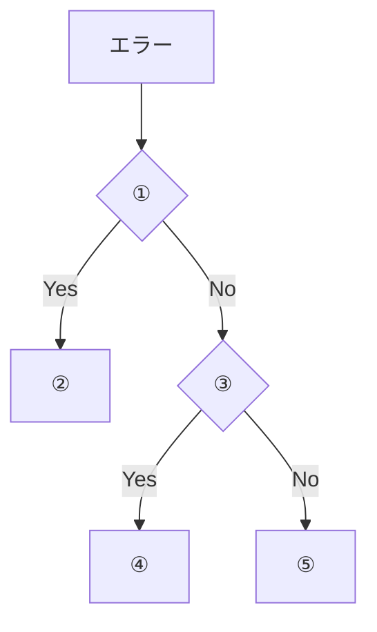

# Flowchart
## TestCaseのエラー処理設定

TestCaseのプロパティでは、実行内容に応じてエラー処理方法を設定すること。

```mermaid
flowchart TD
    A[エラー]
    A --> B{①}

    B -->|Yes| C[②]
    B -->|No| D{③}

    D -->|Yes| E[④]
    D -->|No| F[⑤]
```
### 判定内容

1. 同階層のSmartFolderを実行する必要があるか
2. **次のテストケースに移動**
3. エラー発生を想定したテストか
4. **次の繰り返しに移動して続行**
5. **次の親テストケースに移動**
