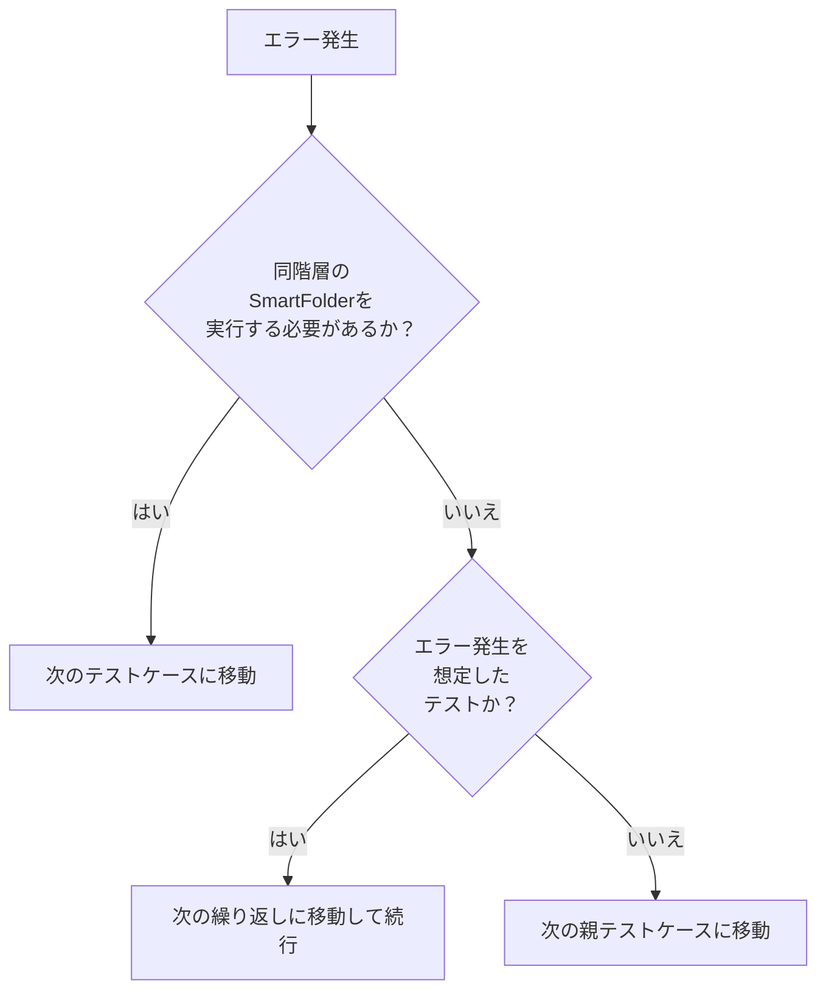

# Flowchart
## TestCaseのエラー処理設定

TestCaseのプロパティでは、実行内容に応じてエラー処理方法を設定すること。

### 設定例

- **次のテストケースに移動**
  - 後処理SmartFolderが存在する
  - エラー後も同階層のSmartFolderを実行する必要がある

- **次の親テストケースに移動**
  - 同階層のSmartFolderは実行不要
  - 親SmartFolderの次の処理へ進めたい
  - 最上位SmartFolderで後続処理が不要

- **次の繰り返しに移動して続行**
  - 異常系テストなど、エラー発生を想定したテスト
  - 繰り返し処理を継続したい
